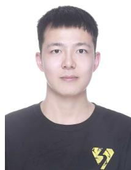
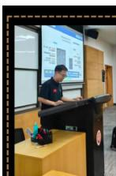

# 师孟笛

汉族 中共党员 河南郑州 1998.4

23s058004@stu.hit.edu.cn • LinkedIn:Mengdi-Shi •GitHub:HKCyber20 •ORCID

# 教育背景

# 哈尔滨工业大学 (深圳) 985

2023.09 - 2026.06

硕士 数学

GPA: 3.43/4.00

导师：赵毅教授

相关课程：代数拓扑应用(99.5),泛函分析(99),多元统计(92.7),随机过程(82.1)

所获荣誉：学业一等奖学金(2024,2025),学业二等奖学金(2023)

# 福州大学211

2018.09 - 2022.06

本科 信息与计算科学

GPA: 3.37/4.00

导师：王美清教授

相关课程：解析几何(95),数学分析(92),电磁学(93),常微分方程(91),数值分析(91)

所获荣誉：学业一等奖学金(2018,2019),学业二等奖学金(2020,2021)

# 论文

# 1.PICFormer: Perception-Inference-Consistency Loop for Occluded 3D Pose Estimation

AAAI Conference on Artificial Intelligence, 2026, CCF-A

Author: Mengdi Shi, Yifeng Wang, Yi Zhao†

- 核心贡献：针对3D姿态估计中的严重遮挡难题，主导设计并实现了业界首个闭环反馈Transformer架构(PICFormer)  
- 关键技术: 独立开发了可见性感知的特征调制 (VFM) 和门控金字塔注意力 (GPA) 等核心模块, 实现了从下游推理到上游感知的动态信息修正  
- 量化成果：模型在权威遮挡基准3DPW-Occ上将MPJPE降低2.9mm，性能超越同期所有SOTA方法。

Code: https://github.com/HKCyber20/PICFormer

# 2.DCT-Based Robotic-Assisted Photoacoustic Tomography for Vascular Longitudinal and Reproducible Monitoring in Human

IEEE Transactions on Robotics Special Issue on "Robot-Assisted Medical Imaging", 2025,SCI 1区 Top

Author:Mengdi Shi*, Chuan Chen*, Yuhan Chen, Guangquan Zhou†, Yongjian Zhao†, Yang Chen

- 核心贡献：针对临床对血管进行长期、可重复监测的需求，创新性地提出了首个基于离散余弦变换(DCT)的频域视觉伺服算法，以应对光声成像低帧率、高噪声的挑战。  
- 关键技术：独立负责算法设计，利用DCT的能量集中特性将数据维度降低  $88.7\%$  ，并推导了从频域特征到机器人6自由度运动的  
- 量化成果：在真实人体实验中，系统能在112次循环内完成高干扰图像的自动追踪，图像相似度达 $98.7\%$ ，追踪速度相比传统DVS方法提升了 $18.84\%$ 。

# 3. Superspreading and Temporal Dynamics of COVID-19 Transmission: Insights from Transmission Settings and Case Detection in Shenzhen

Emerging Infectious Diseases, Under Review, SCI 2区 Top

Author: Wenyu Du*, Zhenghui Feng*, Zhen Zhang*, Mengdi Shi, Yanpeng Cheng, Jia Zhang, Yi Zhao†

- 核心贡献：为深入理解新冠病毒的传播异质性，独创性地提出了“传播环境-病例发现模式”双维度聚类分析框架，对深圳市1329例病例的传播链数据进行了系统性解构。

- 关键技术：独立完成核心数据建模，通过拟合负二项分布模型量化了不同场景的超级传播潜力（ $k$  值），并估算了代际间隔 (SI)，科学评估了各项防控措施的有效性。

- 量化成果：精准量化了  $13.7\%$  的传播链导致  $80\%$  总感染的超级传播现象，识别出交通工具  $(k = 0.10)$  为高风险环境，为深圳市的精准防控策略提供了直接的数据支持。

(*equal contribution, †corresponding author)

# 专利

# 发明专利：一种基于单目相机的三维运动捕捉与智能分析系统及方法

专利号：:ZL202411322456.X

发明人：赵毅；王一峰；包益欣；董显昊；师孟笛

# 发明专利::一种基于惯性-视觉信号增强与融合的运动分析系统

专利号:: ZL 2024 1 1322461.0

发明人：赵毅；王一峰；师孟笛

# 项目与实习经历

# AI算法实习生，深碳科技—南方科技大学

前瞻技术部 导师：张作泰教授|2025.04-2025.09

- 项目目标：传统人工标注方式耗时8小时/文档，且面临术语表达多样性、多模态信息融合、标注数据稀缺等技术挑战，严重制约了材料科学知识发现和数据驱动研究的发展。  
- 个人贡献：(1)主导设计了基于SciBERT-CRF的弱监督序列标注模型，创新性地将Snorkel框架引入材料科学文献处理，通过8个专家知识编码的标签函数实现自动标注，将原始500条人工标注数据扩展至  $8000+$  条训练样本，解决了领域标注数据稀缺的根本问题。

(2)独立开发了四阶段渐进式优化的端到端AI流水线，设计并实现了PDF多模态解析(StageA)、规则基线抽取(StageB)、AI模型增强(StageC)、关系抽取与后处理(StageD)的完整技术架构，每个阶段独立解耦且支持容错回退。

(3) 提出并实现了 442 项术语映射的专业知识库构建方案，建立了材料科学领域 6 大类指标分类体系（材料属性、实验条件、结构参数、成分参数、时间参数、其他数值），并结合  $\pm 20$  词上下文窗口分析和 50 项负样本过滤机制，显著提升了术语识别的召回率和精确率。

- 主要成果：(1)在  $300+$  篇材料科学文献的测试集上，成功抽取20,269条结构化数据，其中材料属性指标12,068条  $(59.5\%)$ ，实验条件3,571条  $(17.6\%)$ ，各类别分布合理且覆盖全面。  
(2)AI增强模型相比规则基线实现了显著性能提升：精确率从0.359提升至0.856，召回率达到0.734，F1-score达到0.791，接近专家标注水平，误报率控制在  $14.4\%$  以内。  
(3) 不同 AI 模型架构对比验证了技术选择的优越性：SciBERT-CRF(F1: 0.791) 显著优于 RoBERTa-BiLSTM(F1: 0.756) 和 ELECTRA-Linear(F1: 0.723)，证明了领域预训练模型和全局优化策略的有效性。

# AI算法实习生，行信科技-香港中文大学

AI算法部 导师：赵永建助理教授|2024.08-2025.03

- 项目目标：针对传统手持式光声成像（PAT）在血管疾病诊断中，操作一致性差、难以进行长期可重复监测的问题，设计一套机器人自动追踪PAT系统。  
- 个人贡献：(1) 创新性地提出并实现了一种基于离散余弦变换 (DCT) 的频域视觉伺服算法，以应对 PAT 成像低帧率、高噪声的物理限制。

(2)独立负责算法核心部分：频域特征提取：将图像数据变换到频域，利用DCT的能量集中特性，仅通过保留前  $25\%$  的低频系数，便实现了数据维度降低  $88.7\%$  的目标，同时有效滤除了噪声。

(3)构建控制模型：推导并构建了从DCT特征变化到机器人探头6自由度运动的交互矩阵，为稳定、精准的闭环控制提供了坚实的理论基础。

- 主要成果：在真实人体实验中，所开发的系统能在112秒内完成对高干扰血管图像的自动追踪，图像相似度高达  $98.7\%$  。与传统的直接视觉伺服(DVS)方法相比，本算法在保证同等精度的前提下，将伺服追踪速度提升了  $18.84\%$  ，展示了在临床应用中的巨大潜力。

# 算法实习生，深圳疾控中心—哈工大深圳

传防所 导师：程雁鹏处长，冯峥晖副教授 | 2024.03 - 2024.08

- 项目目标：深入理解新冠病毒的传播异质性，特别是超级传播事件（SSEs）的驱动机制，为公共卫生部门制定更精准的防控策略提供数据支持。  
- 个人贡献：(1) 创新性地提出了一个“传播环境-病例发现模式”双维度聚类分析框架，对深圳市1329例本地病例的传播链数据进行了系统性解构与分析。

(2) 独立完成了核心数据建模与分析工作：量化传播异质性：通过拟合负二项分布模型，精确估算了不同场景下的离散参数 (k)，识别出交通工具  $(\mathrm{k} = 0.10)$  等超级传播高风险环境。  
(3) 分析传播时间动态：估算了不同情境下的代际间隔 (SI)，发现主动监测手段（如密接追踪）能将 SI 缩短至约 1.6 天，证明了其在快速切断传播链中的关键作用。

- 主要成果：研究发现  $13.7\%$  的传播链导致了  $80\%$  的总感染，高度量化了疫情的超级传播现象。研究成果为精准防控提供了直接的证据支持，相关论文已投稿至《Emerging Infectious Diseases》期刊（审稿中）。  
- 输出对情境化精准防控的可操作建议：优先在高异质且强度高的场景与人群配置资源。

# 学生工作

- 哈尔滨工业大学（深圳）理学院23级数学硕士班 班长，2023-2026  
- 哈尔滨工业大学（深圳）理学院数学党支部 支部委员，2023-2026  
- 福州大学物理与信息工程学院18级数理综合班 班长，2018-2020  
- 福州大学物理与信息工程学院 18 级党支部 支部委员, 2021-2022  
- 福州大学校学生会管委会 负责人，2019-2021

# 学术报告与海报

# 玻尔 +SciMaster 科研智能体大赛

师孟笛

Agent OpenDay, 2025

- 深圳会场：让创造可持续：NexusNMR:AI破解ssNMR 难题

来自哈尔滨工业大学（深圳）的师孟笛带来报告

《NexusNMR：AI破解ssNMR难题，客观、精准、全自动！》

直击ssNMR分析痛点，实现从原始数据到最终报告的全流程自动化分析。

主题演讲

# 获奖与资助

- 高教社杯全国大学生数学建模竞赛国家二等奖  $(\text{top} 3 \%$ , 2021  
全国大学生数学竞赛国家二等奖，2021  
全国大学生数学竞赛国家三等奖，2020  
- 奥林匹克数学邀请赛二等奖，中国(澳门)，2024  
国家励志奖学金，2020，2021，2022  
·哈尔滨工业大学五四表彰”优秀团员"(2024,2025)  
- 哈尔滨工业大学优秀学生 (2024,2025)  
- 黑龙江三好学生 (2025)

# 技能

- 编程：Python（PyTorch）、MySQL、LaTeX、R语言  
- 工具/平台：CUDA、Weights & Biases、Docker、Linux  
- 语言：英语 (CET-6556)、中文 (母语)

# 学术服务

- 审稿人：NeurIPS (2025)、ICML (2025)、AAAI(2025,2026)  
- 学生会员：ACM、IEEE、CCF